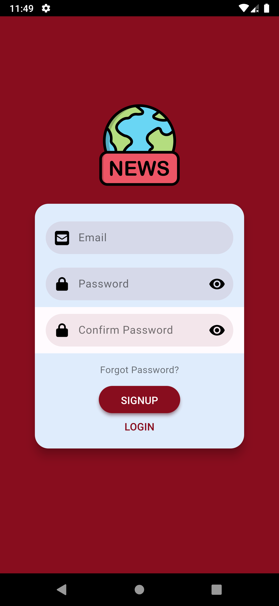
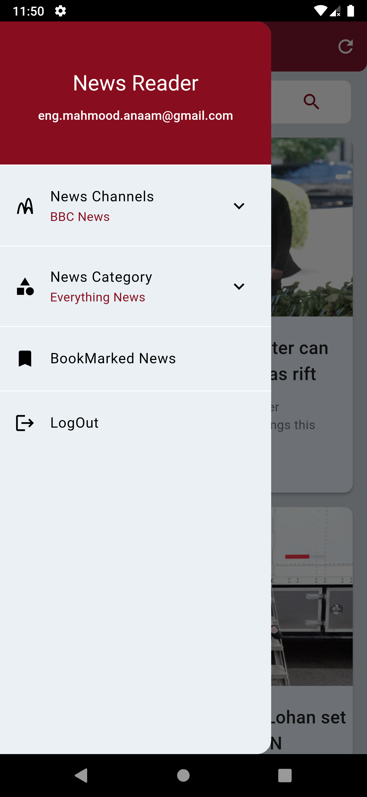
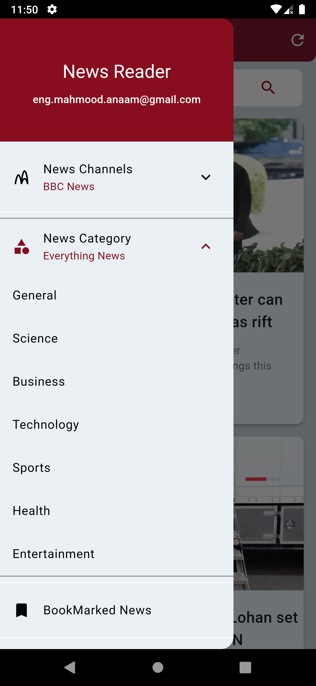

# News Reader Application

News Reader is a Flutter-based mobile application that allows users to read news from various news channels and categories. Users can search for news, bookmark news, view news in a WebView, and manage their accounts with Firebase Authentication.

## Features

- User authentication (sign up, log in, log out, and password reset) using Firebase Authentication.
- Read news from various categories and channels.
- Search for news using the search bar.
- Bookmark news articles for later reading.
- View news articles in a WebView within the app.


## Screenshots
<div>









</div>

## Getting Started

To get started with the News Reader application, follow the instructions below.

### Prerequisites

- Flutter installed on your local machine.
- An API key from [News API](https://newsapi.org/). Create an account and obtain your API key.
- Firebase project set up with Authentication enabled.

### Installation

1. Clone the repository:
    ```bash
    git clone git@github.com:Mahmood-Anaam/News-Reader-Flutter.git
    cd News-Reader-Flutter
    ```

2. Install dependencies:
    ```bash
    flutter pub get
    ```

3. Create a `.env` file in the root directory and add your API key:
    ```env
    API_KEY=your_api_key_here
    ```

4. Configure Firebase:
    - Follow the [Firebase setup instructions](https://firebase.flutter.dev/docs/overview) for your platform (iOS/Android).
    - Add your `google-services.json` (for Android) or `GoogleService-Info.plist` (for iOS) to the respective directory.

### Running the App

To run the app on an emulator or physical device, use the following command:
```bash
flutter run
```

## Libraries Used

- `provider: ^6.1.2`
- `path: ^1.8.3`
- `path_provider: ^2.1.3`
- `http: ^1.2.0`
- `collection: ^1.18.0`
- `shared_preferences: ^2.2.3`
- `webview_flutter: ^4.5.0`
- `firebase_core: ^2.27.0`
- `firebase_auth: ^4.17.8`
- `flutter_login: ^5.0.0`
- `sqflite: ^2.3.2`
- `flutter_dotenv: ^5.1.0`

## Download

You can download the APK file for the News Reader application from the following link:
[Download APK](https://drive.google.com/drive/folders/1ESh6ONP5P5DzblpF1gDr-E5j3LBMWhgx?usp=sharing)

## License

This project is licensed under the MIT License - see the [LICENSE](LICENSE) file for details.


